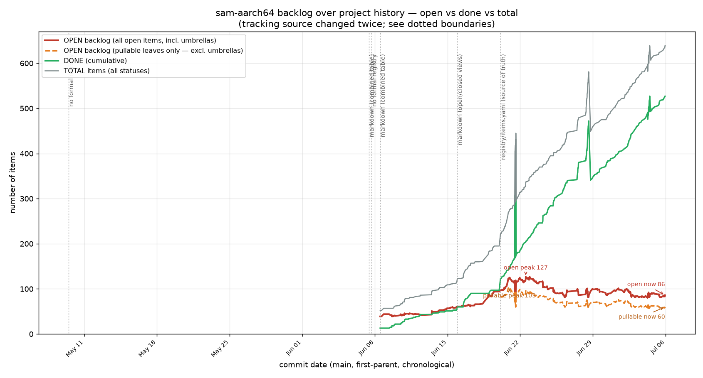

# Backlog size over time — a one-off snapshot

**One-off report (2026-07-06), not maintained.** Pete asked whether the backlog
is genuinely growing or shrinking — it *feels* like it grows while he's away.
Short answer: **the count of actionable open work is flat (~60), not growing;
the ever-rising total item count is what creates the "it grew" impression.**

## What the lines mean

The plot walks every first-parent commit on `main` (chronological) and, at each
commit, counts items from whatever tracking source existed then (the source
moved twice — see *Method* below):

- **TOTAL (gray)** — every item ever created, all statuses. Grows forever: item
  IDs are never reused, and `DONE`/`WONTFIX` items stay in the registry as
  history. **52 → 639** over the tracked window.
- **DONE cumulative (green)** — completed items. **13 → 527**, climbing steeply.
- **OPEN, all (red)** — every `OPEN`/`IN_PROGRESS` item, including umbrellas.
  **39 → peak 127 (~Jun 22) → 86 now.**
- **OPEN, pullable leaves (orange)** — the real actionable queue (`OPEN`/
  `IN_PROGRESS`, excluding umbrellas). **~60 now**, oscillating 50–75 since late
  June.

## The answer

**The open backlog is not running away.** Actionable open work (the orange line)
has been essentially flat in a ~50–75 band since the priority-queue registry
landed in late June, and the all-open line (red) has come *down* from its 127
peak to 86. Meanwhile DONE (green, 527) is climbing as fast as new work is
opened — the gap between TOTAL and DONE (= open) is stable, not widening. So the
autonomous loop is **net-productive**: it closes work at roughly the rate it
takes it on.

Two things explain the "it grew while I was away" feeling:

1. **Total item IDs only ever increase.** The newest ID is now `i372`; watching
   that number (or the gray TOTAL line) always looks like growth, even though
   most of those items are DONE.
2. **Splitting inflates the open count transiently.** A large item is split into
   sub-bricks to stay reviewable — e.g. this session `i31b-b4` became
   `b4a/b4b/b4c/b4d` (+3 open) before any shipped. That is the sawtooth in the
   red/orange lines (and the sharp DONE step-ups when a split's siblings all
   resolve, or a batch is `WONTFIX`'d). It grows the *count* while the *work*
   is being decomposed and delivered, not expanded.

## Method / caveats

- Source of truth moved twice; the plot marks the boundaries with dotted lines:
  early commits had **no formal registry** (no data — left blank), then
  **markdown** tables (`docs/notes/item-registry-*.md`, combined then split),
  then **`registry/items.yaml`** (the current source, from which leaf-vs-umbrella
  and WONTFIX are distinguishable — the orange leaf line only exists in this era).
- "Pullable leaves" excludes umbrellas and `DONE`/`WONTFIX`; it is the closest
  proxy to "work an agent could pick up", i.e. what `build/registry ready` draws
  from. Umbrella-vs-leaf isn't recoverable in the markdown era, so the orange
  line starts only where the YAML does.
- Raw data: the collection script and per-commit CSV were throwaway (scratchpad);
  this doc + plot are the durable artifact. Regenerating is a matter of walking
  `git log --first-parent` and counting statuses per commit.
